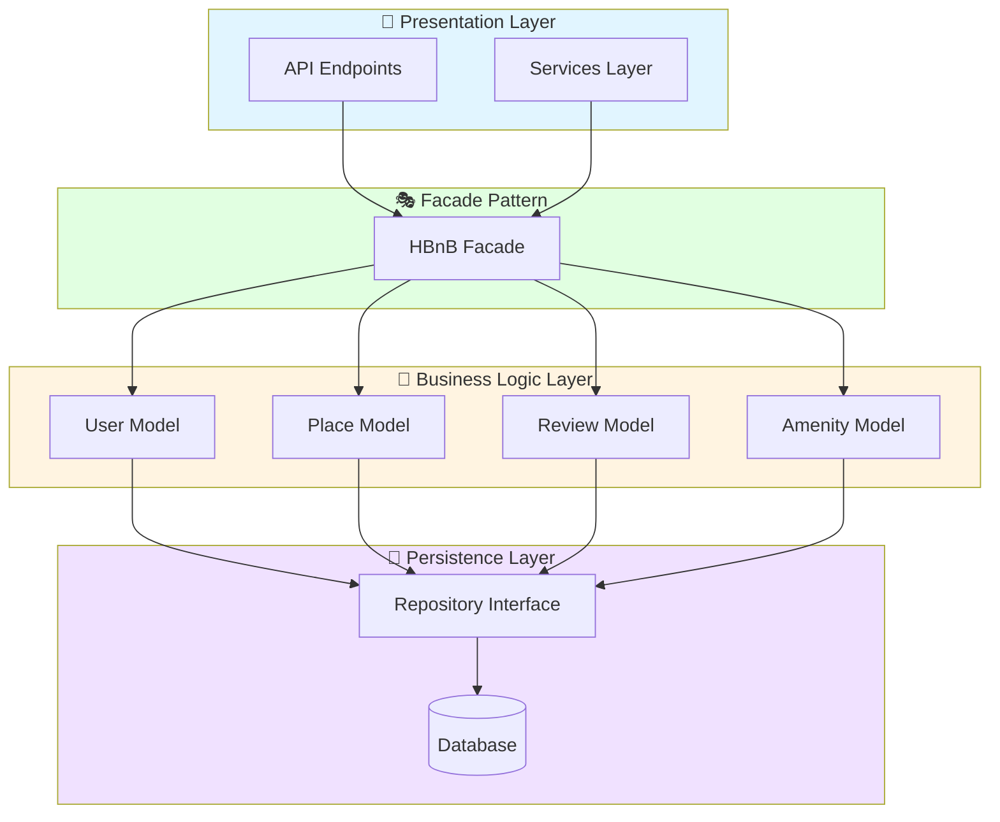

# High-Level Package Diagram

## 📦 Architecture Overview

This diagram illustrates the three-layer architecture of the HBnB application and the communication via the Facade Pattern.

## 🎨 Diagram


## 📋 Layer Descriptions

### Presentation Layer
- **Responsibility**: Handle HTTP requests and responses
- **Components**: API endpoints, Services
- **Technologies**: REST API, JSON

### Business Logic Layer
- **Responsibility**: Implement business rules and entity management
- **Components**: User, Place, Review, Amenity models
- **Patterns**: Domain-Driven Design

### Persistence Layer
- **Responsibility**: Data storage and retrieval
- **Components**: Repository pattern, Database connection
- **Technologies**: To be defined in Part 3

## 🎭 Facade Pattern

The Facade provides a unified interface that:
- Simplifies communication between layers
- Decouples presentation from business logic
- Centralizes orchestration logic
- Improves maintainability

## 🔄 Communication Flow
```
Client → API → Facade → Business Logic → Repository → Database
Client ← API ← Facade ← Business Logic ← Repository ← Database
```