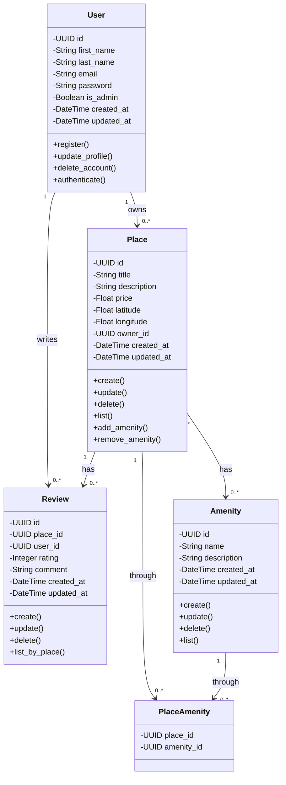

# Detailed Class Diagram - Business Logic Layer

## 🎯 Overview

This diagram details the entities, attributes, methods, and relationships in the Business Logic Layer.

## 📊 Class Diagram

## 📝 Entity Descriptions

### User
**Attributes:**
- `id`: Unique identifier (UUID)
- `first_name`: User's first name
- `last_name`: User's last name
- `email`: User's email (unique)
- `password`: Encrypted password
- `is_admin`: Admin flag
- `created_at`: Registration timestamp
- `updated_at`: Last update timestamp

**Methods:**
- `register()`: Create new user account
- `update_profile()`: Update user information
- `delete_account()`: Delete user account
- `authenticate()`: Verify credentials

### Place
**Attributes:**
- `id`: Unique identifier (UUID)
- `title`: Place title
- `description`: Detailed description
- `price`: Price per night
- `latitude`: Geographic latitude
- `longitude`: Geographic longitude
- `owner_id`: Reference to User
- `created_at`: Creation timestamp
- `updated_at`: Last update timestamp

**Methods:**
- `create()`: Create new place
- `update()`: Update place details
- `delete()`: Delete place
- `list()`: List all places
- `add_amenity()`: Associate amenity
- `remove_amenity()`: Remove amenity

### Review
**Attributes:**
- `id`: Unique identifier (UUID)
- `place_id`: Reference to Place
- `user_id`: Reference to User
- `rating`: Rating (1-5)
- `comment`: Review text
- `created_at`: Creation timestamp
- `updated_at`: Last update timestamp

**Methods:**
- `create()`: Create new review
- `update()`: Update review
- `delete()`: Delete review
- `list_by_place()`: Get reviews for a place

### Amenity
**Attributes:**
- `id`: Unique identifier (UUID)
- `name`: Amenity name
- `description`: Amenity description
- `created_at`: Creation timestamp
- `updated_at`: Last update timestamp

**Methods:**
- `create()`: Create new amenity
- `update()`: Update amenity
- `delete()`: Delete amenity
- `list()`: List all amenities

## 🔗 Relationships

- **User → Place**: One-to-Many (User owns multiple Places)
- **User → Review**: One-to-Many (User writes multiple Reviews)
- **Place → Review**: One-to-Many (Place has multiple Reviews)
- **Place ↔ Amenity**: Many-to-Many (via PlaceAmenity)

## 🎯 Business Rules

1. Each User must have a unique email
2. Places can only be created by registered Users
3. Reviews require both a valid User and Place
4. Ratings must be between 1 and 5
5. Amenities can be reused across multiple Places
6. Timestamps are automatically managed