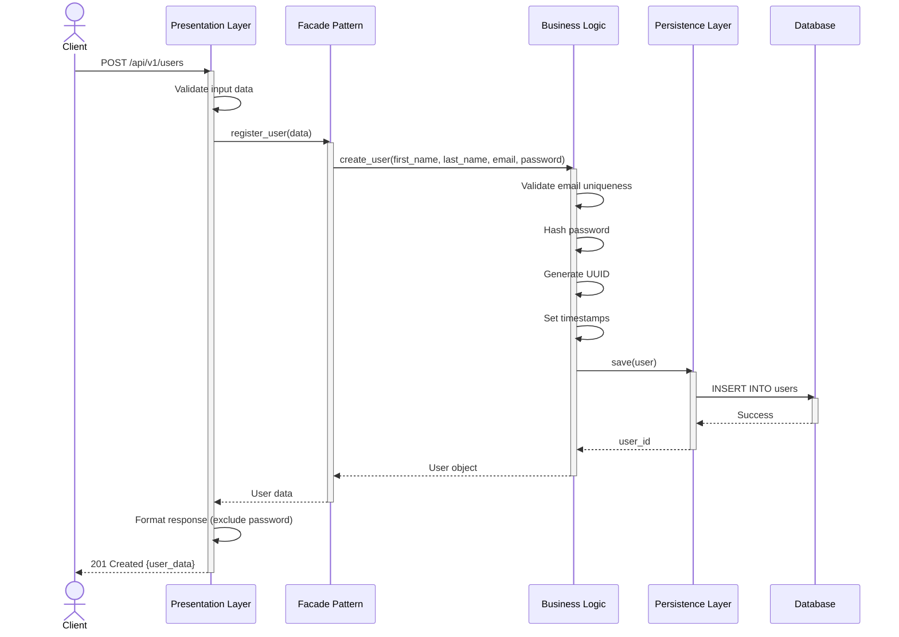
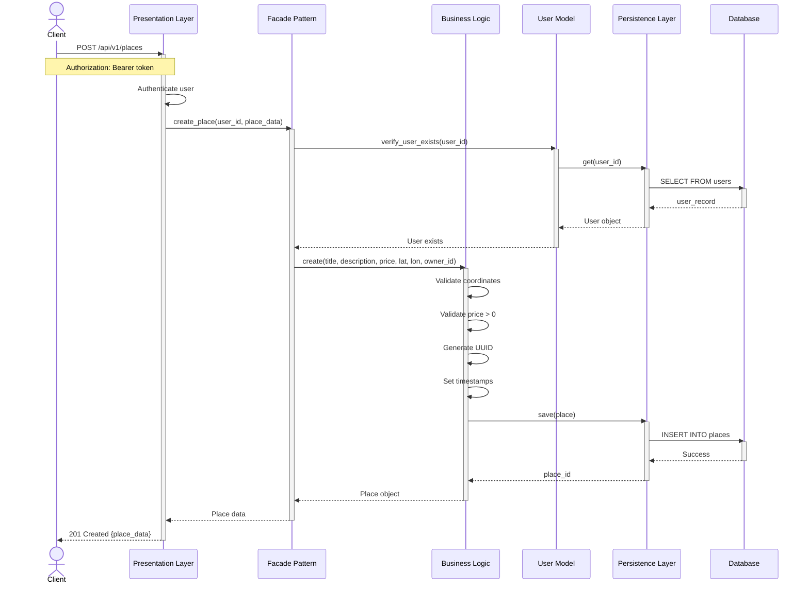
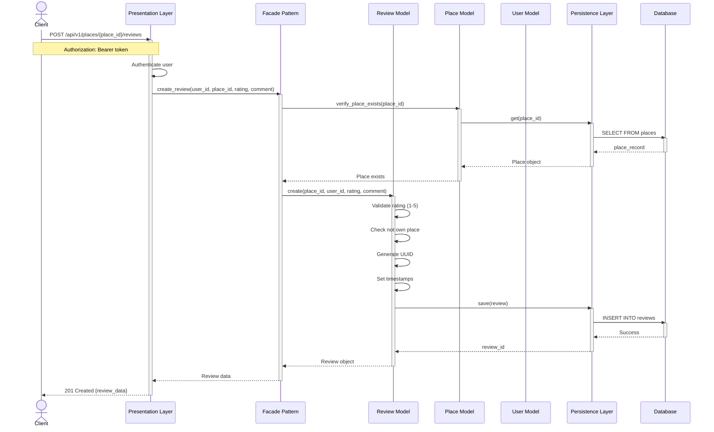
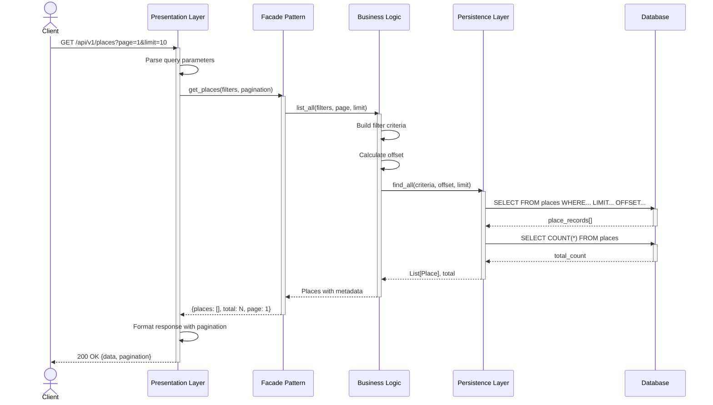

# Sequence Diagrams - API Calls

## 🔄 Overview

These diagrams show the interaction flow between layers for key API operations.

---

## 1️⃣ User Registration


**Steps:**
1. Client sends registration data
2. API validates input format
3. Facade orchestrates user creation
4. Business logic validates and processes data
5. Repository persists to database
6. Response returns created user (without password)

---

## 2️⃣ Place Creation


**Steps:**
1. Client sends place data with authentication
2. API authenticates user token
3. Facade verifies user exists
4. Business logic validates place data
5. Repository persists place
6. Response returns created place

---

## 3️⃣ Review Submissionету


**Steps:**
1. Client submits review with authentication
2. API authenticates user
3. Facade verifies place exists
4. Business logic validates review data
5. System checks user doesn't review own place
6. Repository persists review
7. Response returns created review

---

## 4️⃣ Fetching List of Places


**Steps:**
1. Client requests places list with pagination
2. API parses query parameters
3. Facade processes the request
4. Business logic builds filter criteria
5. Repository queries database with pagination
6. Repository gets total count for pagination
7. Response returns places with pagination metadata

---

## 🎯 Common Patterns

### Authentication Flow
```
Client → API: Request with token
API → API: Verify JWT token
API → Facade: Continue with user_id
```

### Error Handling
```
Layer → Layer: Operation
alt Success
    Layer ← Layer: Result
else Failure
    Layer ← Layer: Error
    API → Client: Error response
end
```

### Validation Pattern
```
1. API: Format validation
2. Facade: Business rule validation
3. Model: Entity-specific validation
4. Repository: Database constraints
```

## 📊 Response Codes

- **200 OK**: Successful GET request
- **201 Created**: Successful POST request
- **400 Bad Request**: Invalid input data
- **401 Unauthorized**: Missing/invalid authentication
- **403 Forbidden**: Insufficient permissions
- **404 Not Found**: Resource not found
- **500 Internal Server Error**: Server error